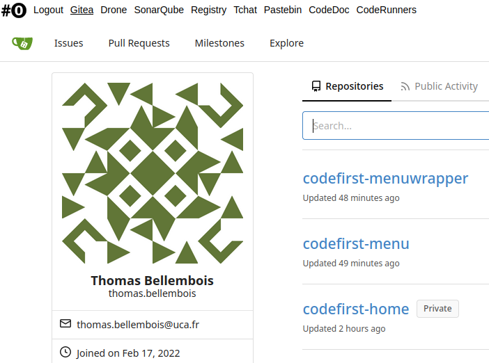

# Code#0 (codefirst)

CI/CD made easy. A project by the [Université Clermont Auvergne (UCA)](https://www.uca.fr/) - France.

Follow us on [LinkedIn](https://www.linkedin.com/company/code-1st).

## Why?

Teaching students to become good developpers.

Provide a full CI/CD infrastucture with a Git repository, CI/CD tools, a Docker registry...

Provide tutorials and documentation to use these tools and sample code per programming languages.

The tools already exist but require time and qualifications to set them up.

## How?

We are creating a full installable package wrapping existing tools with some glue code and tutorials.
We hope to provide an easily deployable CI/CD infrastructure based on Docker containers.

features:
- a git repository powered by [Gitea](https://gitea.io) ([MIT](https://github.com/go-gitea/gitea/blob/main/LICENSE) license)
- a CI/CD tool powered by [Drone](https://www.drone.io) (owned by [Harness](https://harness.io/)) Community Edition ([Apache](https://github.com/harness/drone/blob/master/LICENSE) license)
- a code quality gate powered by [SonarQube](https://www.sonarqube.org) (owned by [Sonarsource](https://www.sonarsource.com/)) Community Edition ([GNU](https://github.com/SonarSource/sonarqube/blob/master/LICENSE.txt) license)
- a Docker [registry](https://docs.docker.com/registry) (owned by [Docker, Inc.](https://www.docker.com/)) ([Apache](https://github.com/distribution/distribution/blob/main/LICENSE) license)
- an artefacts repository (technology not defined yet)
- a pack of Docker images to perform CI/CD for different languages
- tutorials and documentation to quickstart setup CI/CD pipelines

## Who?

Université Clermont Auvergne - France

- Marc Chevaldonné - PhD Professor at the UCA / Project leader.
- Thomas Bellembois - SysAdmin at the UCA

## When?

We hope to provide a first version in the last trimester of 2022.

Code#0 is already running at the UCA and used by students.